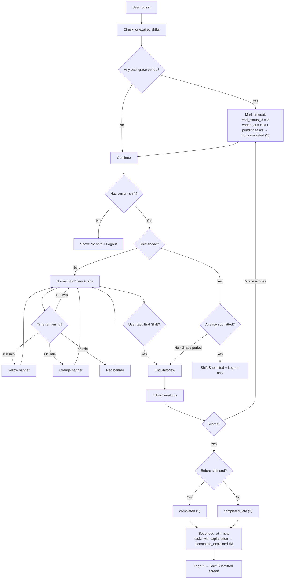

# End Shift Flow Documentation

## Overview

When a caregiver logs into the app, the system checks for their current shift assignment and automatically marks any expired previous shifts (past the 10-minute grace period) as "timeout". During an active shift, caregivers see the full app with all tabs (Shift, Clients, Chat, Emergency) and can work normally. Tasks have six possible statuses: "pending" (id=1) for unaddressed tasks, "completed" (id=2) for finished tasks, "skipped" (id=3), "deleted" (id=4), "not_completed" (id=5) for tasks left incomplete during a timeout, and "incomplete_explained" (id=6) for tasks not completed but with an explanation provided.

As the shift approaches its scheduled end time, color-coded banners appear in the iOS app: yellow at 30 minutes, orange at 15 minutes, and red at 5 minutes remaining. Once the shift's scheduled end time passes, the caregiver enters a 10-minute grace period where they are forced directly into the End Shift View with no access to other tabs—a countdown banner shows exactly how many minutes remain to submit. During this view, they must provide explanations for any incomplete non-custom tasks. These explanations are stored in the `shift_task_status.notes` field as "End shift note: {explanation}", and the task status changes from "pending" (1) to "incomplete_explained" (6).

The shift assignment receives one of three end statuses: "completed" (id=1) if submitted before the shift end time, "completed_late" (id=3) if submitted during the grace period, or "timeout" (id=2) if the caregiver never submitted. For successful submissions, `shift_assignments.ended_at` is set to the submission timestamp.

**Timeout handling:** When the grace period expires without submission, the system detects this the next time the caregiver logs in or the app refreshes. At that point, the `shift_assignments` table is updated with `end_status_id = 2` (timeout) while `ended_at` remains NULL since the user never actually submitted. Additionally, all tasks in `shift_task_status` that were still "pending" (status_id=1) are bulk-updated to "not_completed" (status_id=5), and their `notes` field remains NULL since no explanation was provided.

After any submission or timeout, the current shift disappears. The user sees either a "Shift Submitted" confirmation screen with only a logout button, a "No shift found" error with logout, or their next scheduled shift if one exists. Therefore, it's currently not possible to alter a shift after it has been submitted or timed out.

---

## Flowchart

---

## Database Changes by Scenario

### Successful Submission (before or during grace period)

**shift_assignments:**
| Column | Value |
|--------|-------|
| `ended_at` | Current timestamp |
| `end_status_id` | 1 (completed) or 3 (completed_late) |

**shift_task_status (for incomplete tasks with explanation):**
| Column | Value |
|--------|-------|
| `status_id` | 6 (incomplete_explained) |
| `notes` | "End shift note: {explanation}" |

---

### Timeout (never submitted)

**shift_assignments:**
| Column | Value |
|--------|-------|
| `ended_at` | NULL |
| `end_status_id` | 2 (timeout) |

**shift_task_status (for pending tasks):**
| Column | Value |
|--------|-------|
| `status_id` | 5 (not_completed) |
| `notes` | NULL |

---

## Reference Tables

### task_status_types
| id | name | When Used |
|----|------|-----------|
| 1 | pending | Active shift, not addressed |
| 2 | completed | Task finished |
| 3 | skipped | Skipped during shift |
| 4 | deleted | Removed |
| 5 | not_completed | Timeout, no explanation |
| 6 | incomplete_explained | Submitted with explanation |

### shift_end_status_types
| id | name | When Used |
|----|------|-----------|
| 1 | completed | Submitted before shift end |
| 2 | timeout | Never submitted |
| 3 | completed_late | Submitted during grace period |
| 4 | pendijng | Assignment created, shift not yet completed or submitted |
| 5 | cancelled | Assignment was removed/cancelled before shift completion |

---